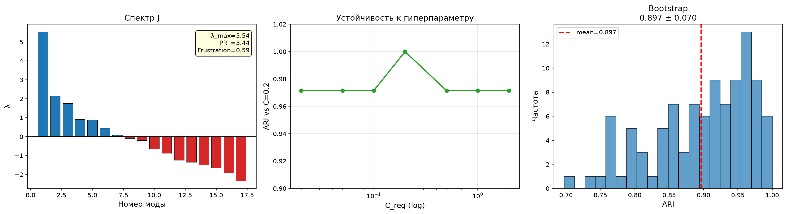
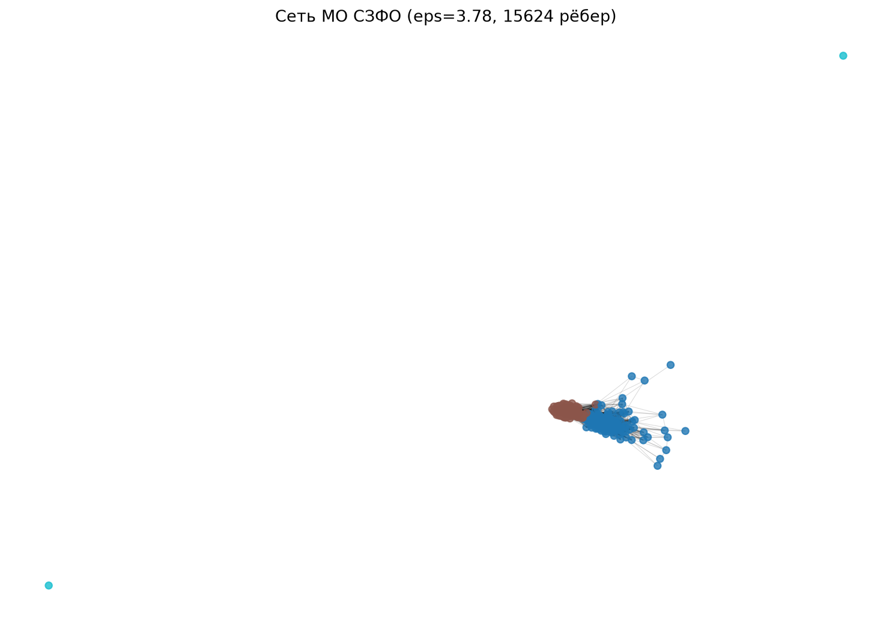
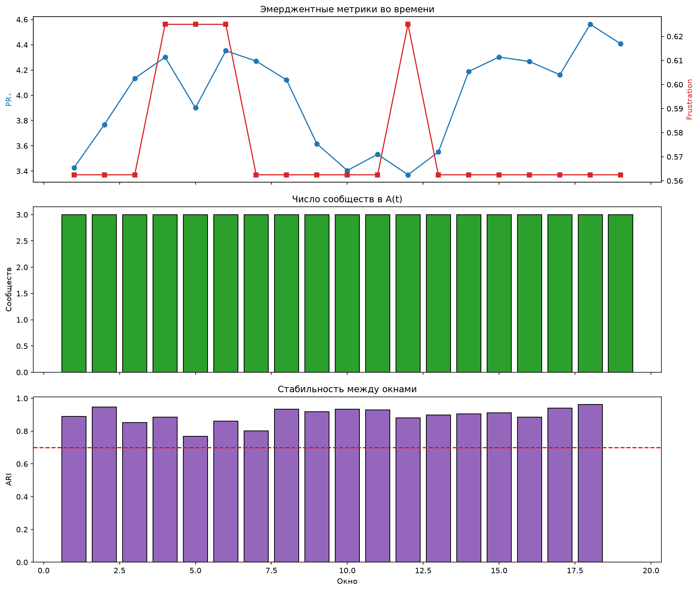
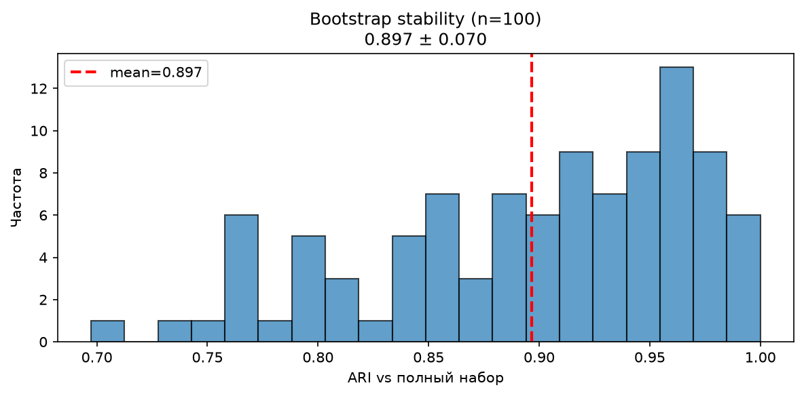

# Методологический отчёт: спектральная типология МО СЗФО

**Источник данных: СберИндекс** — расходы муниципальных образований СЗФО, **2023–2024** (условие конкурса).

**Проект:** спектральная синергетика экономических систем  
**Объект:** 280 муниципальных образований Северо-Западного ФО  
**Основной метод:** медианный threshold по главной моде PLM (`U1 = X @ v1`)  
**Репозиторий:** https://github.com/odisseykingitaki-commits/sber-szfo-spectral  

**Воспроизведение:** `conda activate sber && python run_all.py` (см. `INSTALL.md`)

Числа сверены с `results/final_no_income_summary.json`, `results/icvi_full.csv`, `results/variant_c_comparison.json`.

---

## 1. Постановка

Нужна **устойчивая типология** муниципальных образований по структуре потребительских расходов **СберИндекса** (и смежным признакам), а не простое «разбиение похожих объектов».

Классический KMeans на стандартизованных признаках отвечает на вопрос *похожи ли строки*. Нам интереснее: **какие направления в пространстве признаков согласованы** (спектр оператора зависимостей J), насколько структура «напряжена» (Frustration), и можно ли из главной моды честно получить два читаемых типа поведения расходов.

**Основной результат** — бипартиция **140 / 140** по медиане проекции на первую моду PLM, SW ≈ **0.346**, с проверками bootstrap / robustness / динамики окон. Сетевой Louvain и KMeans — сравнение, не канон.

---

## 2. Данные и признаки

| Источник | Содержание |
|----------|------------|
| **СберИндекс** (основной) | Расходы МО СЗФО, **2023–2024**, категории; выборка МО = покрытие мобильности СЗФО |
| Мобильность (СберИндекс) | две даты → `mob_logratio` |
| Росстат urov | **не** в финальной матрице; только ablation (см. § ограничения) |

Фильтр: МО с ≥ 18 месяцев наблюдений; признаки на базе 2024 (доли/сумма) и 2023–2024 (рост).

### Таблица признаков (p = 17, без income)

| Группа | Признаки | Преобразование |
|--------|----------|----------------|
| Доли категорий | `share_health`, `share_marketplace`, `share_food`, `share_grocery`, `share_transport` | доля в «Все категории», 2024 |
| Масштаб | `log_total` | `log1p(total24)` |
| Рост | `growth_*` (5 категорий) | (mean last3 − mean first3) / (first3 + ε) по окну года / периоду |
| Вариативность | `cv_*` (5 категорий) | σ / μ по месяцам 2024 |
| Мобильность | `mob_logratio` | `log1p(d2) − log1p(d1)` |

Порядок столбцов в PLM (как в `05` / `11`):

```
share_health, share_marketplace, share_food, share_grocery, share_transport,
log_total,
growth_health, growth_marketplace, growth_food, growth_grocery, growth_transport,
cv_health, cv_marketplace, cv_food, cv_grocery, cv_transport,
mob_logratio
```

---

## 3. Метод

### 3.1. Предобработка и бинаризация

1. `X_raw` — матрица N×17.  
2. `X = StandardScaler().fit_transform(X_raw)`.  
3. **Бинаризация:** `X_bin = (X > 0).astype(int)` — порог ноль *после* z-score (эквивалентно порогу по среднему стандартизованного признака), **не** медиана сырых значений.

### 3.2. PLM → спектр J

Для каждого признака j обучается L2-логистическая регрессия остальных на бинарный y_j (`C_reg = 0.2`, solver `lbfgs`). Коэффициенты собираются в матрицу, симметризуется: `J = (J + Jᵀ)/2`, диагональ обнуляется.

Спектр `eigh(J)`, сортировка по убыванию λ. Метрики:

- **PR₊** — participation ratio положительных мод ≈ **3.44**  
- **Frustration** — доля отрицательных λ = 10/17 ≈ **0.59**  
- **λ_max** ≈ **+5.541**; λ_max / Σλ₊ ≈ **47.1%**

### 3.3. Основная типология: median threshold

```
U1 = X @ v1
label = 1 if U1 > median(U1) else 0
```

При чётном N = 280 и отсутствии ties на медиане получается **ровно 140 / 140** — by construction. Это канонические метки: `results/labels_threshold.npy`.

### 3.4. Два уровня структуры

Жюри может спросить: «где сеть?» — у нас **две разные** сетевые конструкции, не одна.

```
Уровень 1 — атрибутивный (сеть признаков)
  17 признаков  →  PLM  →  матрица J  →  спектр мод
  рёбра связывают ПРИЗНАКИ, не муниципалитеты

Уровень 2 — объектный (сеть муниципалитетов)
  МО  →  U = X @ V[:, :5]  →  ε-граф  →  Louvain
  рёбра связывают МО в пространстве мод
```

| Уровень | Что связано | Артефакт |
|---------|-------------|----------|
| **Атрибутивный** | признак ↔ признак | `J`, спектр, главная мода v₁ |
| **Объектный** | МО ↔ МО | ε-граф, сообщества Louvain |

**Канон типологии** — median threshold на проекции U₁ = X @ v₁ (уровень 1 → разрез объектов).  
**Louvain** — дополнительный сетевой взгляд на близость МО (уровень 2), **не замена** канона. Оба уровня опираются на одно пространство мод PLM, но отвечают на разные вопросы.

### 3.5. Сравнение: Louvain (сеть близости МО)

Не основной метод типологии — объектный уровень из §3.4. Строится граф на расстояниях в пространстве проекций на первые 5 мод (`U = X @ V₁₋₅`):

- ε = **40-й квантиль** ненулевых расстояний (≈ **3.781**);  
- рёбер ≈ **15624**, узлов 280;  
- **связные компоненты** графа: **3**, размеры **[278, 1, 1]**;  
- Louvain вызывается на **полном** графе (не на «главной компоненте»), `resolution=0.5`, seed=42;  
- сырые сообщества: **4**, размеры **[149, 129, 1, 1]**;  
- после merge сообществ размера **&lt; 10** → финальные метки **[149, 129, 2]** (`labels_louvain.npy`);  
- SW Louvain ≈ **0.348**, CH ≈ **80.94** (строка `Louvain` в `icvi_full.csv`).

Важно не путать: **[278,1,1]** — компоненты связности; **[149,129,2]** — сообщества после склейки малых. Это не «малые компоненты», а малые *сообщества* Louvain.

### 3.6. Влияние конструкции рёбер (типология vs сеть)

Конкурсный акцент: **порог по главной моде** и **сеть + Louvain** отвечают на разные вопросы.

| | Threshold (канон) | Louvain (сеть) |
|--|-------------------|----------------|
| Вопрос | как разрезать по оси согласованной структуры признаков | кто близок кому в пространстве мод |
| Параметр | медиана U1; C_reg | квантиль расстояний ε(q), resolution, min_size |
| Чувствительность | к C_reg низкая (min ARI ≈ 0.972) | к ε высокая: при малых q граф плотнее/связнее; при q=0.40 — 3 компоненты |
| Размеры | 140/140 by construction | 149/129/2 после merge |
| SW / CH | SW≈0.346, CH≈145.2 | SW≈0.348, CH≈80.94 |

Близость ARI(threshold, Louvain) ≈ **0.835** говорит о согласованности двух взглядов, но **не** о том, что один метод «доказывает» другой: оба используют одно и то же пространство мод PLM. Выбор ε — pragmatic (связный граф на сетке квантилей не получился → q=0.40). Поэтому канон для типологии — threshold; Louvain оставлен как сетевая карта и проверка согласованности.

### 3.7. Устойчивость и динамика

- **Bootstrap** (n=100, ресемпл объектов после scaler на полном N): mean ARI ≈ **0.897** ± 0.070.  
- **Robustness по C_reg** ∈ {0.02…2.0}: **min ARI ≈ 0.972** (точно **0.97153** vs базовая C=0.2).  
- **Динамика:** скользящие окна 6 месяцев по spend → повторная типология; перебежчики **49 / 277 ≈ 17.7%** хотя бы раз сменили кластер за 19 окон.

### 3.8. ICVI

Полная таблица: `results/icvi_full.csv`. Строка **`threshold`** (основной метод):

| K | SW | CH | S_Dbw | AVI | AVU | MQ |
|---|-----:|-----:|------:|----:|----:|----:|
| threshold | 0.3460 | 145.25 | 2.615 | 0.646 | 0.657 | 2.879 |
| Louvain | 0.3481 | **80.94** | 3.037 | 0.771 | 1.629 | 4.468 |

---

## 4. Спектр и интерпретация мод

Собственные значения λ₁…λ₁₇ (`evals_v2.npy`), по убыванию:

| k | λ_k | k | λ_k |
|--:|-----:|--:|-----:|
| 1 | +5.541 | 10 | −0.633 |
| 2 | +2.161 | 11 | −0.866 |
| 3 | +1.754 | 12 | −1.234 |
| 4 | +0.908 | 13 | −1.354 |
| 5 | +0.880 | 14 | −1.479 |
| 6 | +0.448 | 15 | −1.662 |
| 7 | +0.075 | 16 | −1.909 |
| 8 | −0.090 | 17 | −2.339 |
| 9 | −0.199 | | |

n₊ = 7; Σλ₊ ≈ 11.765; λ_max/Σλ₊ ≈ 47.1%.

### Мода 1 (λ ≈ +5.541) — ось типологии

Top-5 по |loading| (`evecs_v2.npy`):

| признак | loading |
|---------|--------:|
| share_food | +0.391 |
| share_grocery | −0.374 |
| share_transport | +0.334 |
| log_total | +0.327 |
| share_health | +0.279 |

Интерпретация (паттерн расходов, не юрстатус МО): один полюс тяготеет к более высокой доле общественного питания / транспорта / масштаба расходов, другой — к более высокой доле продовольствия (grocery). Ярлык «городской / сельский» — удобная краткая метка этого контраста.

Моды 2–5 (кратко): вариативность и рост marketplace; рост food / grocery; мобильность vs marketplace; cv_health / grocery — см. `results/evecs_v2.npy`.

---

## 5. Результаты кластеризации

| Метрика | Threshold (канон) | Louvain |
|---------|-------------------|---------|
| Размеры | **140 / 140** | 149 / 129 / 2 |
| SW | **0.346** | 0.348 |
| CH | 145.25 | 80.94 |
| ARI vs KMeans (K=2) | 0.835 | — |
| ARI threshold↔Louvain | 0.835 | 0.835 |
| Bootstrap ARI | 0.897 ± 0.070 | — |
| Robustness min ARI | ≈ 0.972 | — |









---

## 6. Зачем это практикам

Типология по структуре расходов даёт **компактный язык** для региональной аналитики: два устойчивых режима потребительского поведения на уровне МО, а не набор разрозненных индикаторов. Для политики и мониторинга это полезно как слой сегментации при сравнении программ поддержки, рисковых зон и эффектов шоков — с оговоркой, что ярлык «город/село» здесь про паттерн трат, а не про административный статус. Устойчивость разреза к регуляризации (min ARI ≈ 0.972) и умеренная доля перебежчиков во времени (~18%) позволяют отличать **структурные сдвиги** от шума месяц-к-месяцу. Сетевой взгляд (Louvain) дополняет картину близости территорий в пространстве мод, но для операционных дашбордов каноничнее равные классы threshold. Практическая ценность — в воспроизводимом пайплайне: одни и те же признаки → спектр → метки → окна динамики, без ручной подгонки числа кластеров под красивую карту.

---

## 7. Сравнение методов и честные ограничения

### Сравнение

| Метод | Роль | Комментарий |
|-------|------|-------------|
| Median threshold U1 | **основной** | типология по главной моде |
| Louvain | сетевой | согласован (ARI≈0.84), другой вопрос |
| KMeans K=2 на X / на модах | baseline | ARI≈0.84 ожидаем при общей главной оси |

### Ограничения

1. **Росстат / доходы — только ablation.** В brief часто фигурируют занятость/зарплаты; доступный контур urov в проекте — **доходы** населения, это **не** то же самое, что занятость или зарплаты. Добавление income (Variant C OLS-proxy для unmatched, в т.ч. районы СПб) **не** улучшило SW: **0.346** (no-income) vs **0.345** (Variant C), см. `results/variant_c_comparison.json`. Опциональный код: `src/03_parse_urov.py` (в `run_all` оставлен; финальные признаки в `04` всё равно без income).  
2. Бинаризация z>0; для скошенных признаков доля единиц ≠ 50%.  
3. Мобильность — две даты, грубый `mob_logratio`.  
4. Bootstrap: scaler на полном N → лёгкий optimism.  
5. Выборка МО = список мобильности, не полный ОКТМО.  
6. name_norm: 2 коллизии при внешних join (`заполярный`, `нарьян-мар`).  
7. ARI vs KMeans при K=2 слабо доказывает «уникальность» PLM.

---

## 8. Воспроизводимость

```bash
conda activate sber
pip install -r requirements.txt
# положить сырые данные в data/raw/ (см. INSTALL.md)
python run_all.py
```

Канон меток: `results/labels_threshold.npy`.  
Сводка: `results/final_no_income_summary.json`.  
Конфиги для жюри (source of truth по параметрам): `configs/config.yaml`, `configs/methods.yaml` — скрипты пока дублируют константы; расхождений быть не должно.

**Репозиторий:** https://github.com/odisseykingitaki-commits/sber-szfo-spectral

---

## 9. Краткие выводы

1. Структура расходов МО СЗФО описывается PLM-спектром с доминирующей модой (~47% положительной массы).  
2. Каноническая типология — median threshold → **140/140**, SW≈0.346, устойчивость по C_reg min ARI≈0.972.  
3. Два уровня сети (§3.4): атрибутивный (J) и объектный (ε-граф МО); Louvain — согласованный сетевой взгляд ([278,1,1] компоненты; после merge [149,129,2]), **не** замена threshold.  
4. Доходы Росстата не улучшили качество — честный отрицательный ablation.  
5. Динамика окон показывает живую, но не хаотичную структуру (~18% перебежчиков).
